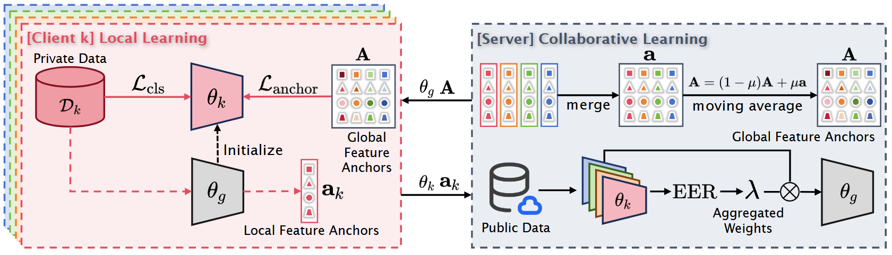

# Federated Learning with Feature Space Separation for Speaker Recognition

### FedFSS


### Training
python train_fed_anchor_lama_gamma.py

### Environment
torch 1.12.1; torchaudio 0.12.1; torchvision 0.13.1  
pip install soundfile, tqdm, matplotlib, Pillow, scikit-learn, numpy

### Result
#### Training on Vox1

| Method | Client1 | Client2 | Client3 | Client4 |
|--------|---------|---------|---------|---------|
| baseline | 6.45 | 6.79 | 6.29 | 6.99 |
| Fedavg | 4.86 |4.94 | 4.98 | 5.62 |
| FedFSS | 4.72 | 4.65 | 4.57 | 5.07 |

### Citation
```bibtex
@inproceedings{meng25_interspeech,
  title     = {{Federated Learning with Feature Space Separation for Speaker Recognition}},
  author    = {Ying Meng and Zhihua Fang and Liang He},
  year      = {2025},
  booktitle = {{Interspeech 2025}},
  pages     = {1518--1522},
  doi       = {10.21437/Interspeech.2025-364},
  issn      = {2958-1796},
}
```

## I'm so glad that our sharing was useful to you.


